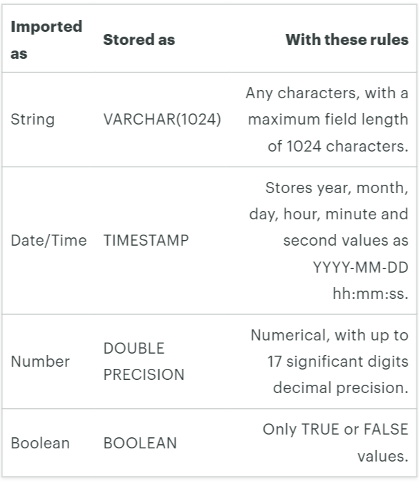

<h3> [참고 사이트] https://mode.com/resources/sql-tutorial/sql-data-types/ </h3>

<h2> Data format </h2>
Data Format에 관한 사진



> 명령어
1. CAST(column_name AS datatype)
1. column_name::datatype


일반적으로 str로 저장된 date (e.g '09-11-2019')를 분리, 계산하기 위해선 
dete칼럼명::timestamp 로 data format을 바꿔주고 진행을 해야함

> Interval function
1. 날짜 타입에다가 특정 기간을 더하거나 뺄 수 있는 함수
1. INTERVAL '숫자 기간'으로 부여하며, 기간에는 week, day, hour, min, sec 모두 가능

  `start_date::timestamp - INTERVAL '1 week' AS study_index`

예시코드
Q. 취득년도와 설립년도의 차이별로 칼럼을 만들어라 (3년/5년)   

```
COUNT(CASE WHEN acquisitions.acquired_at_cleaned <= companies.founded_at_clean::timestamp + INTERVAL '3 years'
                       THEN 1 ELSE NULL END) AS acquired_3_yrs,
COUNT(CASE WHEN acquisitions.acquired_at_cleaned <= companies.founded_at_clean::timestamp + INTERVAL '5 years'
                       THEN 1 ELSE NULL END) AS acquired_5_yrs
```
   
나는 시간 - 시간을 통해서 구하려고 했는데, 그러려면 아직 뭔가들 더 배워야할 듯.   
Error메세지로 timezone 필요하다는 둥 뭐라함


### What does it mean to 'Data wrangling' ?   

프로그래밍 방식으로 데이터를 작업하기 쉽게 포맷을 개선하는 작업을 말함.   
일반적으로 데이터는 에러(입력 오류, 크롤링 오류 등)가 있기 마련이고,   
이를 전처리하는 과정으로 보면 됨.


### Data Cleaning

#### 1. Clearing strings

> str 편집 함수   

1. Left : 엑셀과 동일 LEFT(칼럼명, 숫자)

1. Right: 엑셀과 동일 RIGHT(칼럼명, 숫자)

    ```
    LEFT(date, 10) AS cleaned_date,
    RIGHT(date, length(date)-11) AS cleaned_time,
    left(RIGHT(date, length(date)-11), 8) AS cleaned_hours
    ```

1. Trim : Leading(문자의 맨 왼쪽), Trailing(맨 오른쪽), Both(양쪽의 문자)를 사용함.  
e.g  (20.4)에서 괄호를 제거하려면
	```
	TRIM(Leading '(' FROM 칼럼명) → 첫괄호 제거  
	TRIM(Both '()' FROM 칼럼명) → 양쪽괄호 제거
	```                
1. Substr : 엑셀 mid와 동일, Substr(칼럼명, 시작위치, 끝위치)

1. StrPos : 엑셀 find랑 비슷, 해당 string에서 찾으려는 문자의 위치를 반환함   
            e.g  Strpos(pizza, 'A') = 5
            
1. Concat : 엑셀 concat과 동일, CONCAT( ) 쉼표로 합치는 거 까지 동일

1. UPPER, LOWER : 대문자, 소문자 변환, UPPER(칼럼명), LOWER(칼럼명)

1. Length 함수 : 엑셀의 len 과 동일
